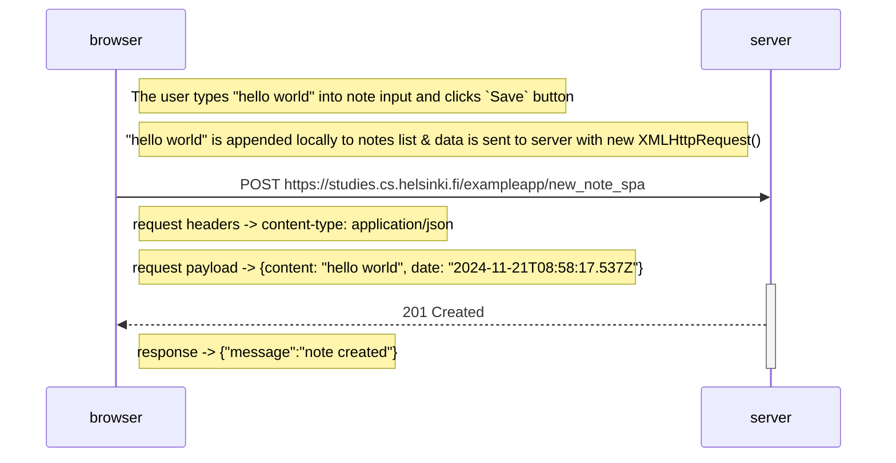

```mermaid
sequenceDiagram
    participant browser
    participant server

    Note right of browser: The user types "hello world" into note input and clicks `Save` button
    Note right of browser: "hello world" is appended locally to notes list & data is sent to server with new XMLHttpRequest()
    browser->>server: POST https://studies.cs.helsinki.fi/exampleapp/new_note_spa
    Note right of browser: request headers -> content-type: application/json
    Note right of browser: request payload -> {content: "hello world", date: "2024-11-21T08:58:17.537Z"}
    activate server
    server-->>browser: 201 Created
    Note right of browser: response -> {"message":"note created"}
    deactivate server

```
